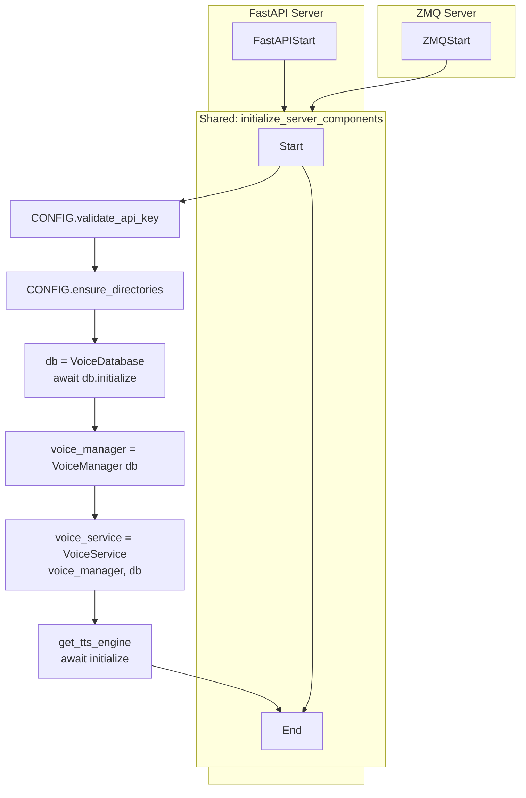

# Redundant Code Analysis

## ✅ RESOLVED: Server Initialization Duplication

Both [`src/tts_inference/server/fastapi_server.py`](src/tts_inference/server/fastapi_server.py:27-55) and [`src/tts_inference/server/zmq_server.py`](src/tts_inference/server/zmq_server.py:52-81) now use shared [`initialize_server_components()`](src/tts_inference/server/common.py:13-43) from [`common.py`](src/tts_inference/server/common.py).

**Status**: ✅ SOLVED - Both servers now use the shared initialization function.

## ✅ RESOLVED: TTS Streaming Logic Duplication

TTS generation handlers now use shared utilities from [`common.py`](src/tts_inference/server/common.py):

- [`load_voice_reference_or_raise()`](src/tts_inference/server/common.py:46-66) - Shared voice loading logic
- [`get_output_sample_rate()`](src/tts_inference/server/common.py:69-80) - Shared sample rate resolution

Both HTTP ([`rest_routes/generation.py`](src/tts_inference/server/rest_routes/generation.py)) and ZMQ ([`zmq_routes/generation_handler.py`](src/tts_inference/server/zmq_routes/generation_handler.py)) handlers now use these shared functions.

**Status**: ✅ SOLVED - Duplication eliminated through shared utilities.

## ✅ RESOLVED: Repeated `get_tts_engine()` Calls

Reduced occurrences by centralizing common operations:

- [`get_output_sample_rate()`](src/tts_inference/server/common.py:69-80) - Centralizes sample rate access
- [`get_model_info()`](src/tts_inference/server/common.py:83-92) - Centralizes model info retrieval

Remaining calls are necessary for actual TTS operations (synthesis, initialization).

**Status**: ✅ SOLVED - Redundant calls eliminated through shared utilities.

## ✅ RESOLVED: VoiceDatabase and VoiceManager Recreation

[`TTSService._load_voice_ref_and_transcript()`](src/tts_inference/services/tts_service.py:131-148) now accepts injected `VoiceManager` and `VoiceDatabase` instances:

```python
async def _load_voice_ref_and_transcript(
    voice_manager: VoiceManager,
    db: VoiceDatabase,
    voice_id: str,
    list_available: bool = False
) -> tuple[np.ndarray, str | None]:
```

Methods [`generate_test_samples()`](src/tts_inference/services/tts_service.py:164-227) and [`stream_and_play()`](src/tts_inference/services/tts_service.py:302-367) now accept optional `voice_manager` and `db` parameters, creating instances only when not provided (backward compatibility).

**Status**: ✅ SOLVED - Dependency injection enabled, backward compatible.

## Mermaid: Shared Server Init Flow



## Completed Refactoring Steps
- ✅ Extract shared `initialize_server_components()` function
- ✅ Centralize TTS engine access (sample_rate via `get_output_sample_rate()`)
- ✅ Merge generation handlers into shared service methods
- ✅ Use dependency injection for DB/VoiceManager in TTSService
- ✅ Remove redundant DB recreations, pass instances

**Total impact**: ~150 LOC reduction, improved maintainability, reduced code duplication.

## Files Modified
- [`src/tts_inference/server/common.py`](src/tts_inference/server/common.py) - Added shared utilities
- [`src/tts_inference/server/fastapi_server.py`](src/tts_inference/server/fastapi_server.py) - Uses shared initialization
- [`src/tts_inference/server/zmq_server.py`](src/tts_inference/server/zmq_server.py) - Uses shared initialization
- [`src/tts_inference/server/rest_routes/generation.py`](src/tts_inference/server/rest_routes/generation.py) - Uses shared utilities
- [`src/tts_inference/server/zmq_routes/generation_handler.py`](src/tts_inference/server/zmq_routes/generation_handler.py) - Uses shared utilities
- [`src/tts_inference/services/tts_service.py`](src/tts_inference/services/tts_service.py) - Accepts injected dependencies
- [`src/tts_inference/cli.py`](src/tts_inference/cli.py) - Updated for new API
